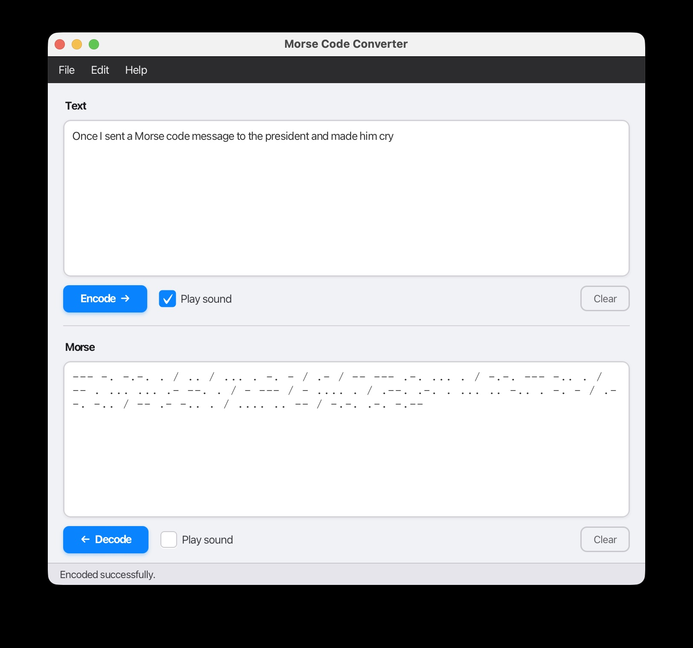

# Morse Code Converter

A Java application that converts text ↔ Morse code with optional audio playback. It can be executed as a command line app or GUI that uses JavaFX.

## Files

| File | Description |
|------|-------------|
| `morse.jar` | Pre-built executable JAR (Java 21) |
| `Main.java` | CLI entry point, argument parsing |
| `MainWindow.java` | GUI window |
| `MorseConverter.java` | Encode/decode logic |
| `MorseGui.java` | JavaFX application entry point |
| `MorsePlayer.java` | Audio tone playback via `javax.sound` |
| `MorseConverterTest.java` | JUnit 5 unit tests |
| `pom.xml` | Maven build file |

## Requirements

- Java 17+ JRE to **run** the pre-built JAR
- Java 17+ JDK + Maven to **build from source**

## Usage

```bash
# Encode text → Morse
java -jar morse.jar encode "Hello World"

# Decode Morse → text
java -jar morse.jar decode ".... . .-.. .-.. --- / .-- --- .-. .-.. -.."

# Encode with audio tones
java -jar morse.jar encode --play "SOS"

# Decode with audio tones
java -jar morse.jar decode --play "... --- ..."

# Run the GUI
java -jar morse.jar gui

# Help
java -jar morse.jar --help
```

## Morse Format

- `.` = dot, `-` = dash
- Single **space** separates letters
- ` / ` (space-slash-space) separates words

## Supported Characters

- Letters: A–Z (case-insensitive)
- Digits: 0–9
- Punctuation: `. , ? ! - / @ ( )`

## Audio Playback (`--play`)

Uses Java's built-in `javax.sound.sampled` API — no external dependencies.

- **Frequency:** 700 Hz (classic Morse receiver tone)
- **Speed:** ~20 WPM standard timing
  - Dot = 60 ms
  - Dash = 180 ms
  - Letter gap = 180 ms
  - Word gap = 420 ms
- Sine-wave with ramp envelope to eliminate clicks

## Build from Source

```bash
# With Maven (builds fat JAR → target/morse.jar)
mvn package

# Run tests
mvn test
```

## Examples
### Command Line
```
$ java -jar morse.jar encode --play "SOS"
┌─ Input (Text) ────────────────────────────────────────
│  SOS
├─ Output (Morse) ──────────────────────────────────────
│  ... --- ...
└───────────────────────────────────────────────────────

$ java -jar morse.jar decode --play "-- --- .-. ... ."
┌─ Input (Morse) ───────────────────────────────────────
│  -- --- .-. ... .
├─ Output (Text) ───────────────────────────────────────
│  MORSE
└───────────────────────────────────────────────────────
```

### GUI
```
java -jar morse.jar gui
```


## Notes

This app doesn't use CW (it uses Java's built in sound API) so it can't be sent transmitted like normal Morse code. But the output is suitable to send using FM using GMRS frequencies.
